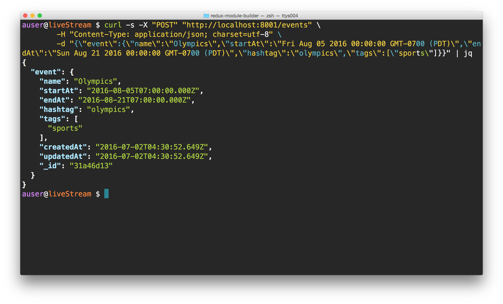
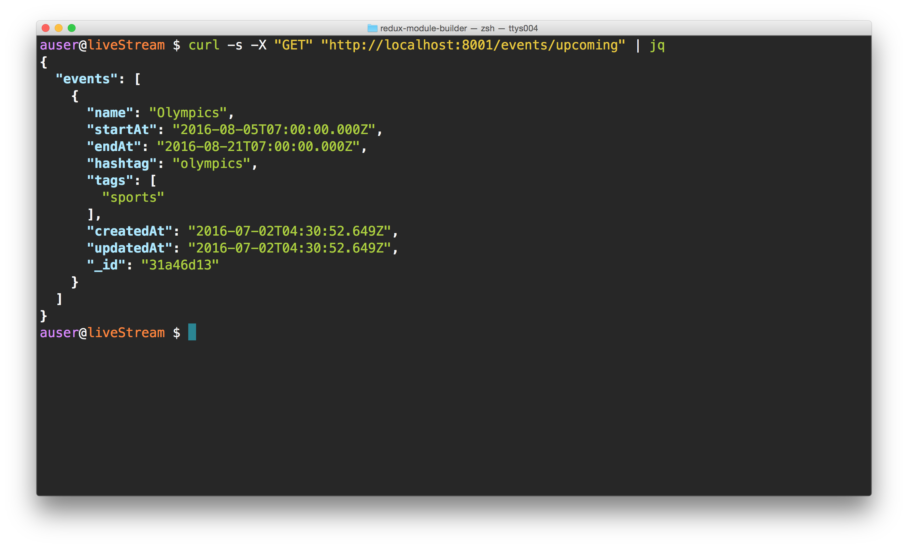
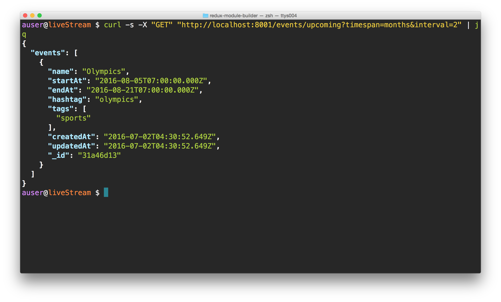
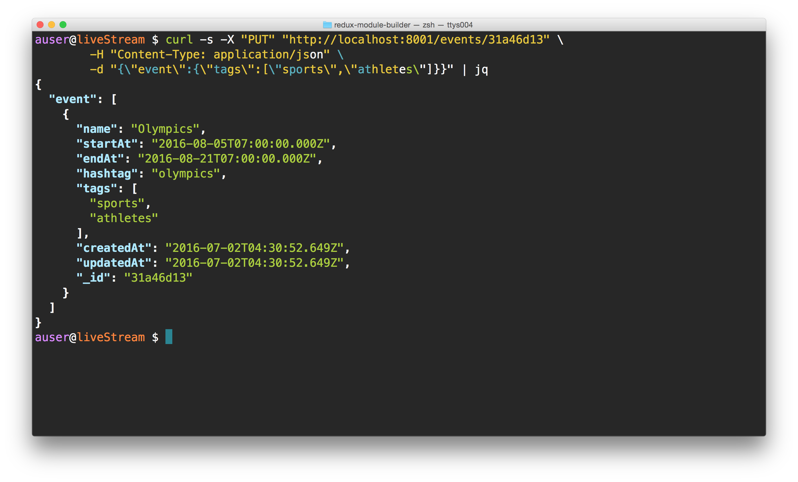
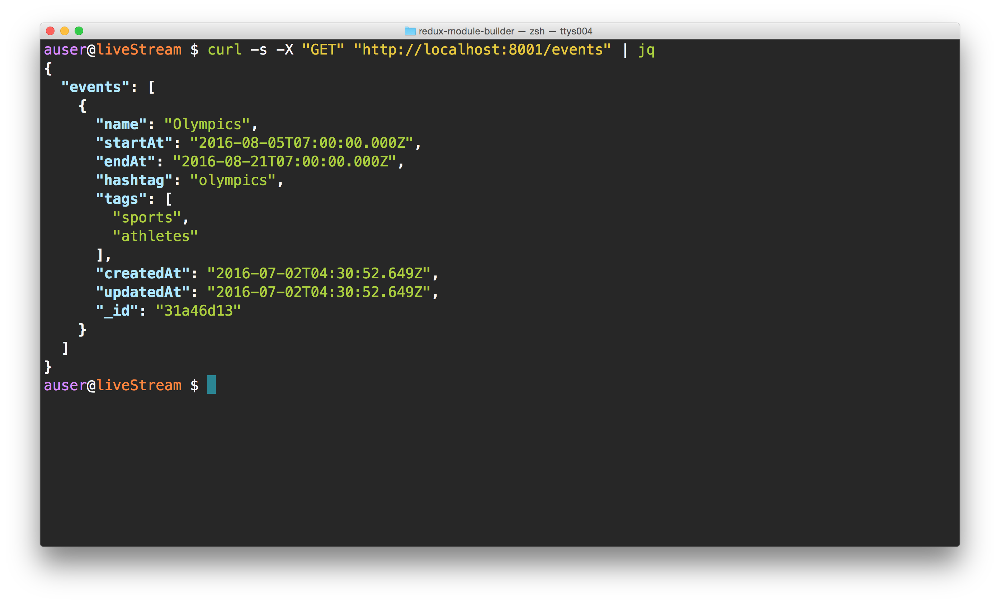
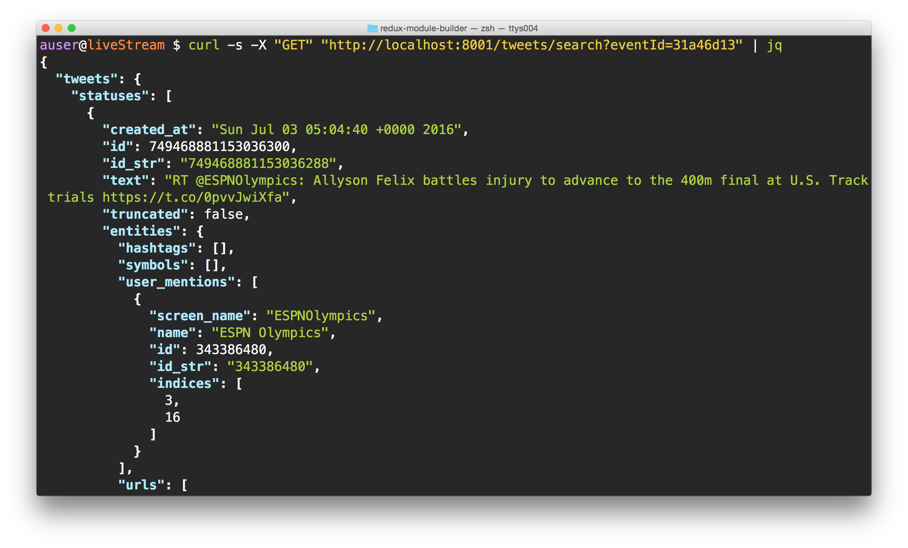
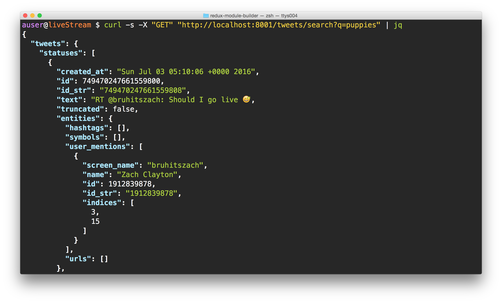
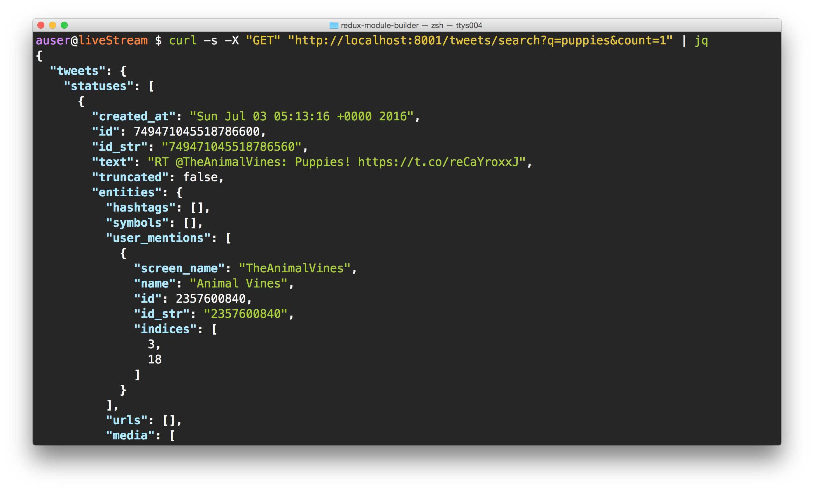

## Realtime news server

The `Realtime news` server is a demo server intended on working with demo front-end applications that hosts the following services.

It serves several end-points including a real-time twitter feed updates.

It includes the following methods to connect:

* REST
* websockets
* Server Sent Events (coming soon)

It is graciously built with the following technologies:

* [node](http://nodejs.org)
* [express](http://expressjs.com/)
* [linvodb3](https://github.com/Ivshti/linvodb3)
* [levelup](https://github.com/Level/levelup)

We use the leveldb database to provide an easy method for connecting other datbase backends to the system in the future. For the time being, the `LinvoDB` API provides a nice wrapper around a single-node filesystem backend. Combining the speed of `NeDB` with the live query capabilities of leveldb, `LinvoDB` is a good choice for speed and single-node database requirements.

## Quickstart (locally)

To get this guy running, clone the repo and install the dependencies:

```bash
git clone https://github.com/fullstackio/realtime-news.git
cd realtime-news
npm install
```

We'll also need a `.env` file at the root of the realtime-news directory. Copy the `.env.example` file at the root to your own.

```bash
cp .env.example .env
```

We'll fill this information out later (see [setting up twitter](#tweets)).

All of the relevant scripts for managing the library are bundled in the `package.json`'s `scripts`. We'll start up our server in `dev` mode by using the `dev` script, like so:

```bash
npm run dev
```

Visit the url `http://localhost:3000` in your browser and you'll should see the running server.

## API Documentation

The backend server has several components, which mostly revolve around the events API.

> Note:
> We are using the `jq` tool to colorize the output of our terminal. We can't recommend `jq` enough. Install the tool if you want the same colorized, structured output in your terminal.

### Events

Events are the core model in the system. We'll use events to track relevant, immediate information for our live news streamer.

For current details about the `Event` schema, check the model at `./lib/models/event.js`. It currently holds the schema:

| Field | Type | Default value | Description |
|-------|------|---------------|-------------|
| name  | String | | The tite of the event, like `olympics` |
| startAt | Date | | The event starting date/time |
| endAt | Date | | The event's ending date/time |
| hashtag | String | | A hashtag to filter tweets |
| tags | [String] | [] | Other tags associated with the event |

#### List all events (`GET /events`)

First, let's check our events for any events current events:

```bash
curl -s -X "GET" "http://localhost:8001/events" | jq
```


Hrm, with no events, we can't really do very much. Let's add an event.

#### Add an event (`POST /events`)

```bash
curl -s -X "POST" "http://localhost:8001/events" \
	-H "Content-Type: application/json; charset=utf-8" \
	-d "{\"event\":{\"name\":\"Olympics\",\"startAt\":\"Fri Aug 05 2016 00:00:00 GMT-0700 (PDT)\",\"endAt\":\"Sun Aug 21 2016 00:00:00 GMT-0700 (PDT)\",\"hashtag\":\"olympics\",\"tags\":[\"sports\"]}}" | jq
```



After we've added an event, let's check to make sure it was added by using the `_id` event to query against.

#### GET event by id (`GET /events/:id`)

```bash
curl -s -X "GET" "http://localhost:8001/events/31a46d13" | jq
```


Certainly looks like our event has been added.

#### Get recent event (`GET /events/upcoming`)

We don't expect our users to know what the latest event ids are, so we'll provide a method for looking for the latest ones using an upcoming API.

To get the default upcoming events (i.e. all events upcoming from today forward), we can call the api without any query parameters:

```bash
curl -s -X "GET" "http://localhost:8001/events/upcoming" | jq
```



In cases that we don't want to list the entire events database and limit the timespan to a certain interval and timespan, we can pass the query options `timespan` and `interval`. For instance, to list only the upcoming events for the next two months:

```bash
curl -s -X "GET" "http://localhost:8001/events/upcoming?timespan=months&interval=2" | jq
```



> In this case, we still only have one event that starts in the next two months, so the output will be the same. However, this _is_ does provide a limit on the query.

#### Update an event (`PUT /events/:id`)

Let's add some details to our event by sending an update request to our backend using the update API. We'll use a similar syntax as the ADD an event API, but pass the event id in the URL

```bash
curl -s -X "PUT" "http://localhost:8001/events/31a46d13" \
        -H "Content-Type: application/json" \
        -d "{\"event\":{\"tags\":[\"sports\",\"athletes\"]}}" | jq
```



Let's check the event to make sure it's been updated in the database using our upcoming api:

```bash
curl -s -X "GET" "http://localhost:8001/events/upcoming" | jq
```



#### Remove an event (`DELETE /events/:id`)

Awesome. Finally, we can delete a single event with the delete API. Let's add one to delete (keeping around our existing event for later).

```bash
curl -s -X "POST" "http://localhost:8001/events" \
	-H "Content-Type: application/json; charset=utf-8" \
	-d "{\"event\":{\"name\":\"Presidentail election, 2016\",\"startAt\":\"Tue Nov 08 2016 00:00:00 GMT-0500 (EST)\",\"endAt\":\"Tue Nov 08 2016 00:00:00 GMT-0500 (EST)\",\"hashtag\":\"election\"}}" | jq
```


Now, let's delete this event by it's `id`:

```bash
curl -s -X "DELETE" "http://localhost:8001/events/df11c0de" | jq
```


#### Clear _all_ events (`DELETE /events/_clear`)

To wipe out the entire database of events, use the `_clear` api.

```bash
curl -s -X "DELETE" "http://localhost:8001/events/_clear" | jq
```

## Tweets

The Realtime news server serves twitter stream messages as we well over a REST API.

In order to use this api, we have a bit more set up. [Get authorization from Twitter](https://apps.twitter.com) to get started. Update your `.env` file with the information at the root of your clone.

```bash
TWITTER_KEY=YOUR_TWITTER_KEY
TWITTER_SECRET=YOUR_TWITTER_SECRET
TWITTER_ACCESS_KEY=YOUR_TWITTER_ACCESS_KEY
TWITTER_SECRET_KEY=YOUR_TWITTER_SECRET_KEY
```

After you've set these values, we're ready to get a search cursor, which we can use to make a request for tweets. As we'll see, we can get a live search query (where our server will send out broadcasts of new tweets) or a static one. The REST API is simple and gives us back a static list of tweets.

### Getting a list of tweets (`GET /tweets/search`)

To get a list of tweets based upon a search term or an event (these are essentially the same query with two different query params), we can use the search API.

The basic search query without any parameters will find the latest event and use that search to make a request. For instance, in this demo query, the latest event is our olympics event, so the following will make a search to twitter with the hashtag associated with the olympics event's hashtag: `olympics`:

```bash
curl -s -X "GET" "http://localhost:8001/tweets/search" | jq
```


We can pass an event id to the search with the query parameter of `eventId`, like so:

```bash
curl -s -X "GET" "http://localhost:8001/tweets/search?eventId=31a46d13" | jq
```



If no event is found by the `eventId`, the query will return null _unless_ a query parameter of `q` is passed (as a way to allow the REST server to act as a twitter proxy to search twitter in a generic way).

```bash
curl -s -X "GET" "http://localhost:8001/tweets/search?q=puppies" | jq
```



We can limit the count of tweets we want to get back by passing a `count` parameter. For instance, if we just want to get a single tweet, we can easily do this by passing a count of 1 into our query.

```bash
curl -s -X "GET" "http://localhost:8001/tweets/search?q=puppies&count=1" | jq
```



To see this more clearly, let's use the `jq` tool to show us the text of all the tweets we are requesting in the last query.

```bash
curl -s -X "GET" "http://localhost:8001/tweets/search?q=dogs&count=1" | \
  jq .tweets.statuses[].text
```
